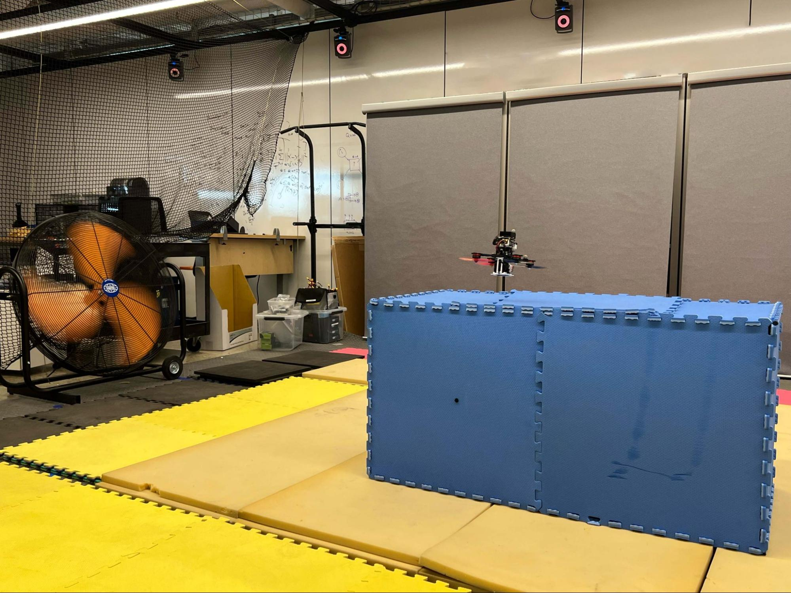

# AEROSP 740: Online Learning for Control
{: .fs-9 }

**Fall 2025 -- University of Michigan**
{: .fs-6 .fw-300 .text-center}

This website will be used to publish course labs, handouts, and other materials.  
All important resources and updates for the course will be available here.

**Acknowledgement:** Labs 1 and 2 are based on the content from [Visual Navigation for Autonomous Vehicles](https://vnav.mit.edu/) course taught at MIT. 

- See **[Lab Handouts](labs/)**  